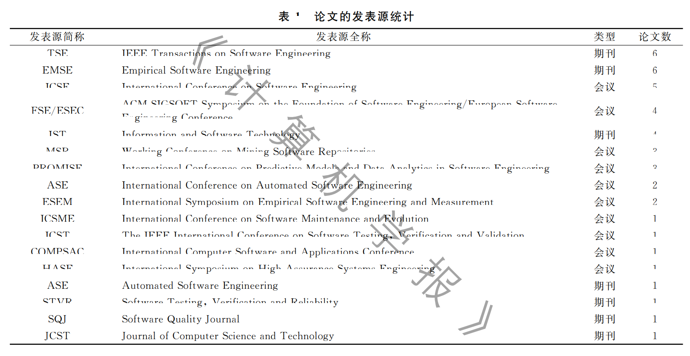
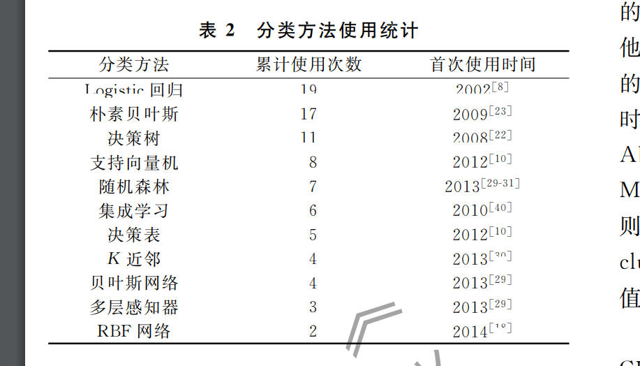

# 类不平衡问题
## 数据层面的解决方法
**过采样**：SMOTE 
**欠采样**：
**数据增强**
## 算法层面的解决方法
**代价敏感学习**
**集成方法**：BalancedBaggingClassifier、AdaBoostClassifier

# 跨项目缺陷预测遇到的问题
## 数据分布不一致
域适应
迁移学习
## 类不平衡问题
过采样与欠采样
代价敏感学习
集成学习
## 小样本问题
数据增强
生成对抗网络
跨项目聚合
## 特征选择与特征表示
自动化特征选择
特征表示学习
多视角特征融合
## 模型泛化能力不足
元学习
混合模型
模型正则化

# 基于元学习的跨项目缺陷预测
研究可以包括元学习模型的设计和优化，以及在多个项目之间的应用与验证。探索如何通过元学习来增强模型的适应性，尤其是在不同项目之间缺陷分布差异较大的情况下，快速迁移学习策略。   

# 类不平衡处理的优化策略
针对CPDP中的类不平衡问题，开发和评估新的平衡技术，如基于生成对抗网络（GANs）的数据增强、集成过采样与欠采样技术，以及代价敏感学习。   

# 多视角特征融合与特征选择
通过集成多种特征（如代码复杂度、历史缺陷记录、开发人员特征等），提升模型的预测能力。   

# 基于GAN的跨项目缺陷预测
利用生成对抗网络（GANs）生成虚拟的缺陷样本，以解决数据稀缺性问题。   

# 基于动态分布对其和伪标签学习的跨项目缺陷预测
采用域适应方法解决跨项目预测效果不佳，域适应+GAN

# 综述
基于有监督学习的方法：主要基于候选源项目集的程序模块来构建模型。根据源项目与目标项目采用的度量元是否相同又可以细分为同构跨项目缺陷预测方法和异构跨项目缺陷预测方法,针对前者,研究人员主要从度量元取值转换,实例选择和权重设置、特征映射和特征选择、集成学习、类不平衡学习等角度展开研究,而后者更具研究挑战性,研究人员主要基于特征映射和典型相关分析等方法展开研究。
基于无监督学习的方法直接尝试对目标项目中的程序模块进行预测,这类方法假设在软件缺陷预测问题中,有缺陷模块的度量元取值存在高于无缺陷模块的度量元取值的倾向,因此研究人员主要基于聚类方法展开研究,
而基于半监督学习的方法则会综合使用候选源项目集的程序模块和目标项目中的少量已标记模块来构建模型,这类方法通过尝试从目标项目中选出少量模块进行标记,以提高跨项目缺陷预测的性能

随后我们从论文发表源这一角度，对论文的发表数进行了统计(仅统计了软件工程领域的权威期刊和会议)，并按照论文数从大到小进行排序，最终结果如表1所示.其中排名前五的发表源分别是TSE、EMSE、ICSE、FSE/ESEC 和 IST.其中 ICSE和 FSE/ESEC是中国计算机协会推荐的软件工程领域中的 A类会议,TSE是A类期刊,而 EMSE 和IST 均是 B类期刊:

