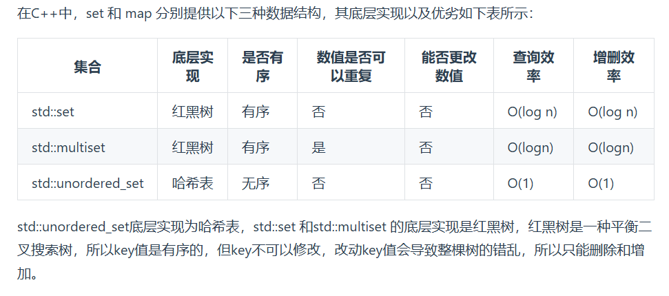
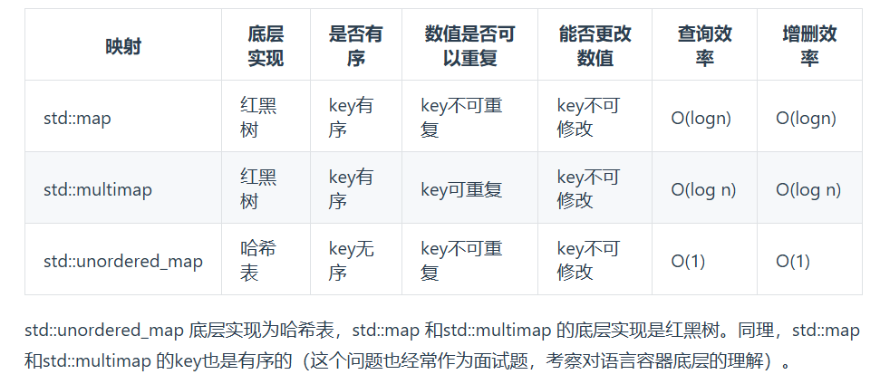
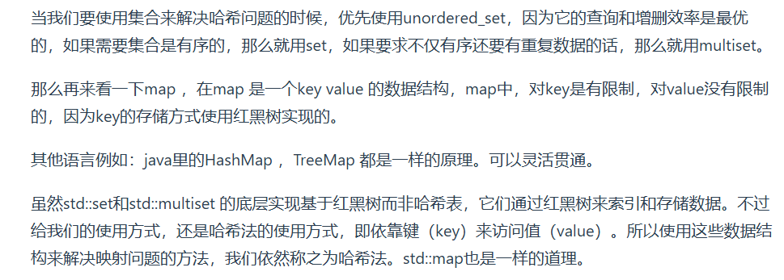

# 哈希表
hash table   
一般哈希表都是用来快速判断一个元素是否出现在集合里   
# 哈希函数
把原始数据转化为数值，再对tableSize取模   
# 哈希碰撞
## 拉链法
把冲突的元素放在这个位置的链表里   
要选择适当的哈希表大小，不需要tableSize > dataSize，既不会因为数组空值而浪费大量内存，也不会因为链表太长而在查找上浪费太多时间   
## 线性探测法
使用线性探测法，一般要保证tableSize > dataSize，需要依靠哈希表中的空位来解决碰撞冲突问题   
# 常见的三种哈希结构
数组   
set（集合）
map（映射）

# 总结
遇到要快速判断一个元素是否出现在集合里的问题，就使用哈希表   
哈希法是牺牲空间换时间，要用额外的数组、set或map来存放数据，才能实现快速的查找   