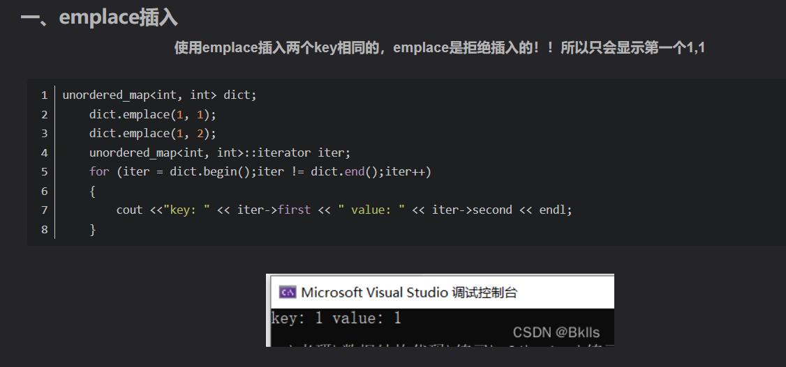

# 整体思路
```c++ {.line-numbers}
class Solution {
public:
    vector<int> twoSum(vector<int>& nums, int target) {
        unordered_map<int,int> hashTable;
        for(int i = 0; i < nums.size(); i++){
            if(hashTable.find(target-nums[i]) != hashTable.end())
                return vector<int>{i, hashTable[target-nums[i]]};
            hashTable[nums[i]] = i;
        }
        return vector<int>();
    }
};
```
[C++哈希表插入元素方式](https://blog.csdn.net/YourClerk/article/details/123967991)




