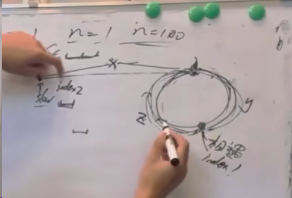

# 快慢指针
## 判断环
快指针每次走两个节点，慢指针每次走一个节点，如果快慢指针相遇，则说明有环，否则无环。   
在环里，快指针相对于慢指针移动，是以一个节点的移动速度来追慢指针   
## 找出环的入口
从相遇点到入环点的距离加上 n−1 圈的环长，恰好等于从链表头部到入环点的距离。   
因此，当发现 slow 与 fast 相遇时，我们再额外使用一个指针 ptr。起始，它指向链表头部；随后，它和 slow 每次向后移动一个位置。最终，它们会在入环点相遇。   
slow = x + y   
fast = x + y + n * （y + z）  
fast = 2 * slow 即   
2 * （x + y） = x + y + n * （y + z）   
即x = n * （y + z）- y ，n ≥ 1   
x = （n - 1） * （y + z） + z   

从head出发，从相遇点出发，二者相遇点即为环的入口点   
# 代码实现
```c++ {.line-numbers}
fast = head;
slow = head;
while(fast != NULL && fast->next != NULL){
    fast = fast->next->next;
    slow = slow->next;
    if(fast == slow){
        index1 = fast;
        index2 = head;
        while(index1 != index2){
            index1 = index1->next;
            index2 = index2->next;
        }
        return index1;
    }
}
return NULL;
```
