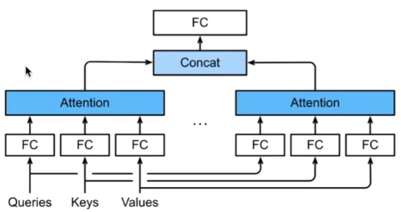

# 多个输入通道
彩色图像可能有RGB三个通道   
转换为灰度会丢失信息   
每个通道都有一个卷积核，结果是所有通道卷积结果的和（单输出通道）   

# 多个输出通道
我们可以有多个三维卷积核，每个核生成一个输出通道    
# 多个输入和输出通道
每个输出通道可以识别特定模式   
输入通道核识别并组合输入中的模式   
# 1×1卷积层
kh = kw = 1是一个受欢迎的选择。它不识别空间模式，只是融合通道   

# 二维卷积层

# 总结
输出通道数是卷积层的超参数   
每个输入通道有独立的二维卷积核。所有通道结果相加得到一个输出通道结果   
每个输出通道有独立的三位卷积核   

# 代码
## 实现一下多输入通道互相关运算    
## 计算多个通道的输出的互相关函数
## 1×1卷积
