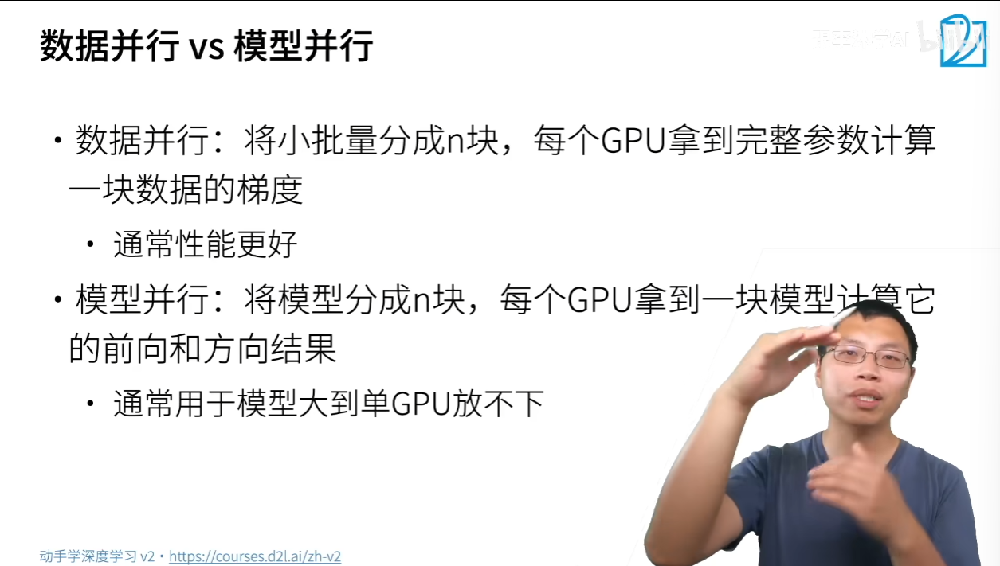
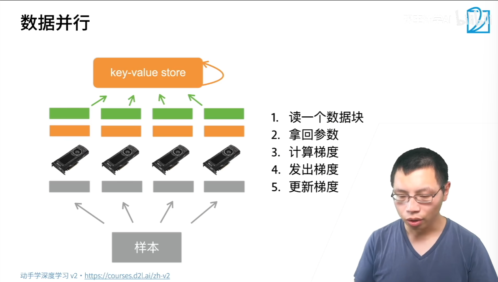

一台机器可以安装多个GPU   
在训练和预测时，我们将一个小批量计算切分到多个GPU上来达到加速目的   
常用切分方案有   
    数据并行   
    模型并行   

# 数据并行
1.读一个数据块    
2.拿回参数   
3.计算梯度   
4.发出梯度   
5.更新梯度    

# 总结
当一个模型能用单卡计算时，通常使用数据并行拓展到多卡   
模型并行则用在超大模型上   
