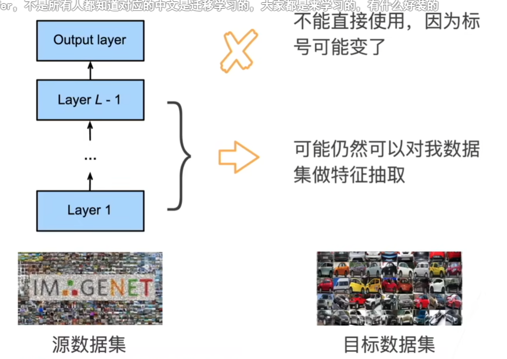
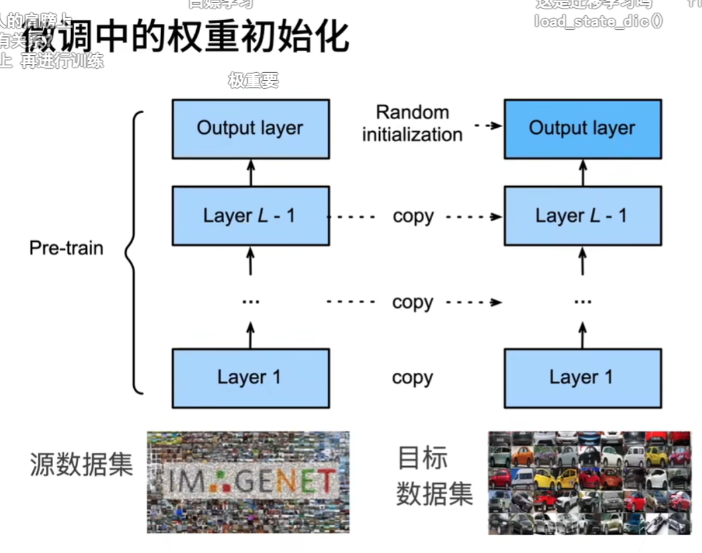

# 标注一个数据集很贵
# 网络架构
一个神经网络一般可以分成两块   
特征抽取将原始像素变成容易线性分割的特征   
线性分类器来做分类   
# 微调

# 微调中的权重初始化

网络模块的权重直接复制   
# 训练
是一个目标数据集上的正常训练任务，但使用更强的正则化   
使用更小的学习率   
使用更少的数据迭代   
源数据集远复杂于目标数据，通常微调效果更好   
# 重用分类器权重
源数据集可能也有目标数据中的部分标号   
可以使用预训练好模型分类器中对应标号对应的向量来做初始化   
# 固定一些层
神经网络通常学习有层次的特征表示：   
· 低层次的特征更加通用   
· 高层次的特征则更跟数据集相关   
可以固定底部一些层的参数，不参与更新
# 代码
# 热狗数据集
# 图像的大小和纵横比各有不同
# 数据增广
normalization   
# 定义和初始化模型
pre_train=True
# 微调模型
最后一层学习率大一点 10倍  别的地方学习率不需要很大   
# 使用较小的学习率
# 为了进行比较，所有模型参数初始化为随机值
