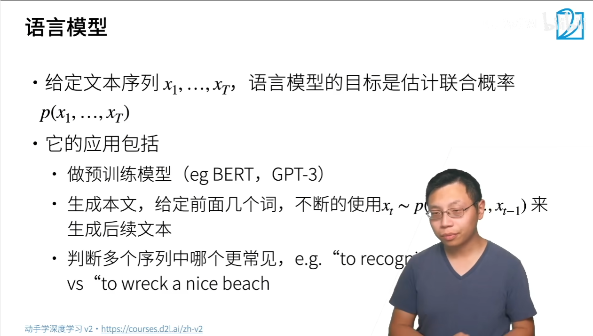
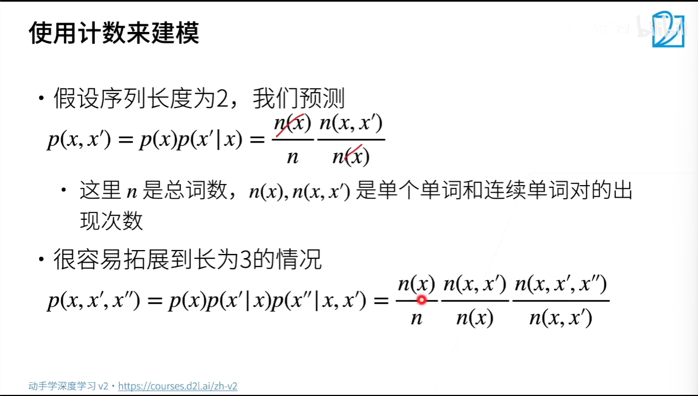
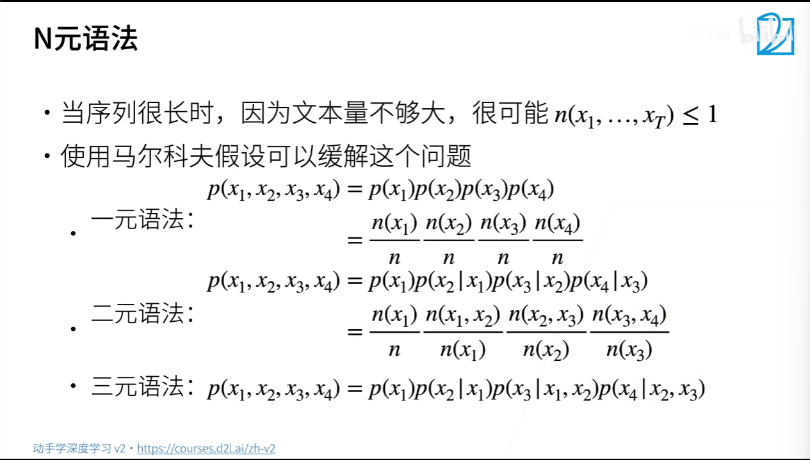
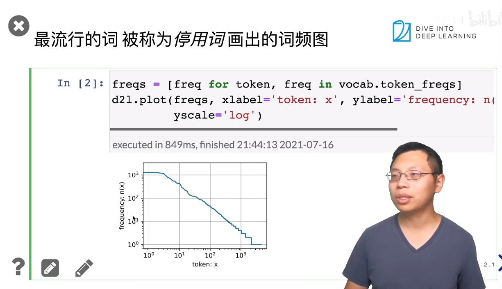
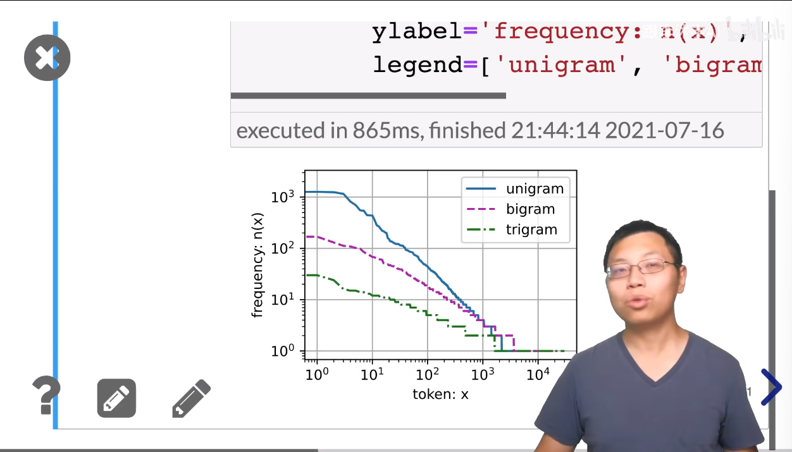
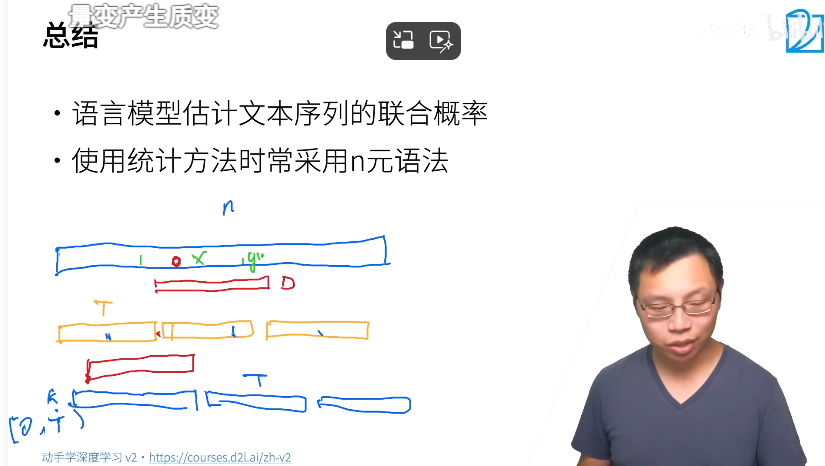

# 语言模型

# 使用计数来建模

# n元语法

好处：可以处理比较长的序列   
每次看的序列长度是固定的   
二元语法、三元语法用的比较多，比如把所有的二元词存起来，每次看一个长为2的子序列，空间换时间   
# 总结
语言模型估计文本序列的联合概率   
使用统计方法时常采用n元语法   

# 代码
## 语言模型和数据集
### 最流行的词 被称为 停用词 画出词频图

### 其他的词元组合 二元 三元 

## 随机地生成一个小批量数据的特征和标签以供读取。在随机采样中，每个样本都是在原始的长序列上任意捕获的子序列
每个batch都重新切   

### 生成一个从0到34的序列
每个minibatch都独立 随机采样   
## 保证两个相邻的小批量中的子序列在原始序列上也是相邻的
## 将上面两个采样函数包装到一个类中

# QA

