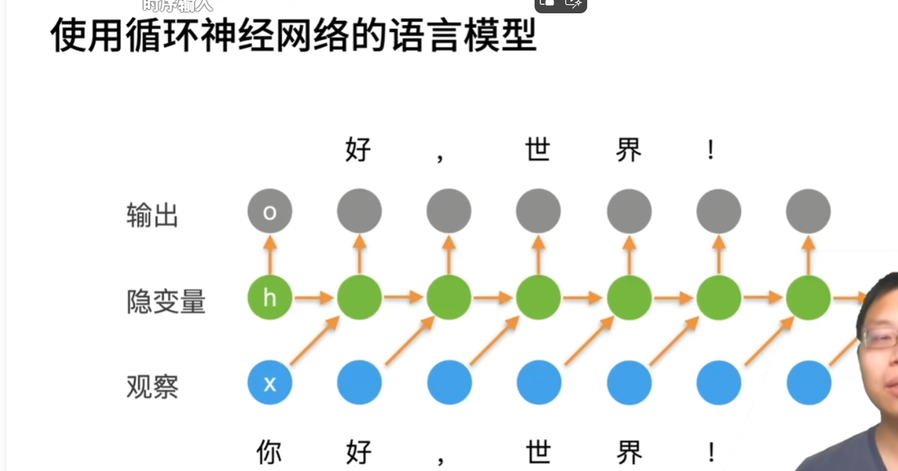

# RNN
## 潜变量自回归模型
使用潜变量ht总结过去信息   

## 循环神经网络
·更新隐藏状态   
·输出   

## 困惑度（perplexity）
衡量一个语言模型的好坏可以用平均交叉熵   

## 梯度裁剪

## 更多的应用RNNs
one to one   
one to many文本生成  问答、机器翻译   
many to one文本分类   
many to manyTag生成   
## 总结
循环神经网络的输出取决于当下输入和前一时间的隐变量   
应用到语言模型中时，循环神经网络根据当前词预测下一次时刻词   
通常使用困惑度来衡量语言模型的好坏   

# QA
