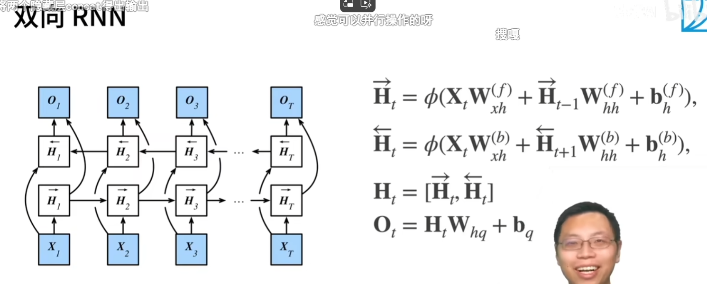

# 双向RNN
## 未来很重要
取决于过去和未来的上下文，可以填很不一样的词   
在填空的时候，我们也可以看未来   
## 双向RNN
一个前向RNN隐藏层   
一个方向RNN隐藏层   
合并两个隐状态得到输出   

## 推理
适用于翻译、改写、对序列抽取特征、填空   
不适用于预测   
## 总结
双向循环神经网络通过反向更新的隐藏层来利用方向时间信息   
通常用来对序列抽取特征、填空，而不适用于预测未来   

# 代码
bidirectional=True   

# QA
正向反向concat   

