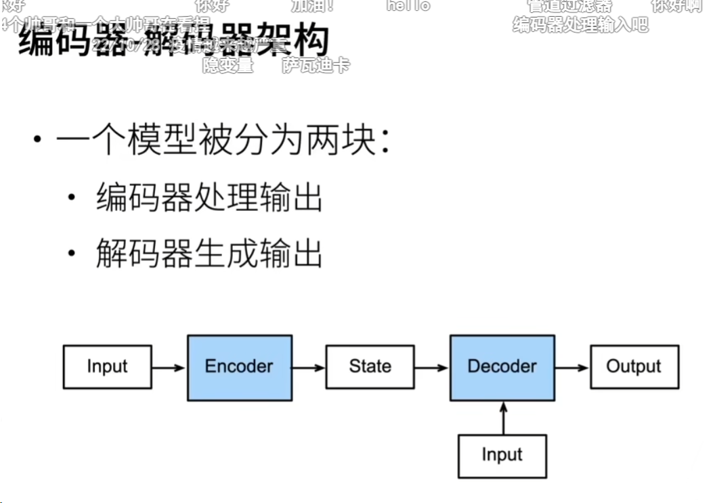

# 重新考察CNN
编码器  特征抽取   
解码器  Softmax回归   
编码器：将输入编程成中间表达形式（特征）   
解码器：将中间表示解码成输出   
# 重新考察RNN
编码器：将文本表示成向量   
解码器：向量表示成输出   
# 编码器-解码器架构
一个模型被分为两块：   
编码器处理输出   
解码器生成输出   

# 总结
编码器负责表示输入，解码器负责输出   

# 代码
## 编码器
## 解码器
## 合并编码器和解码器
