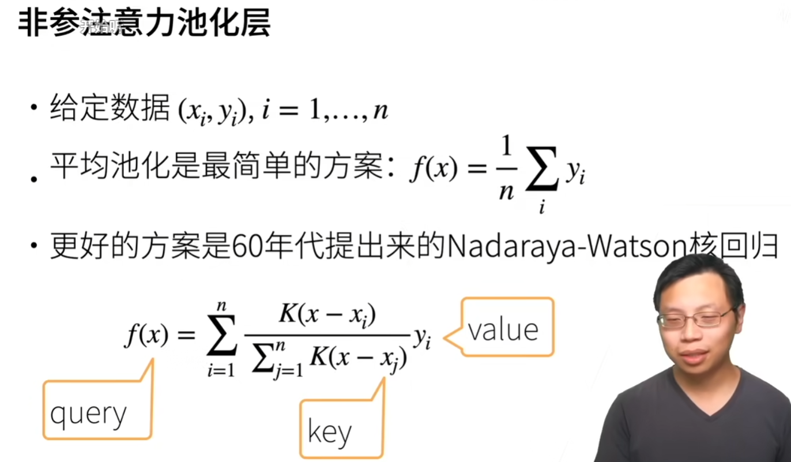
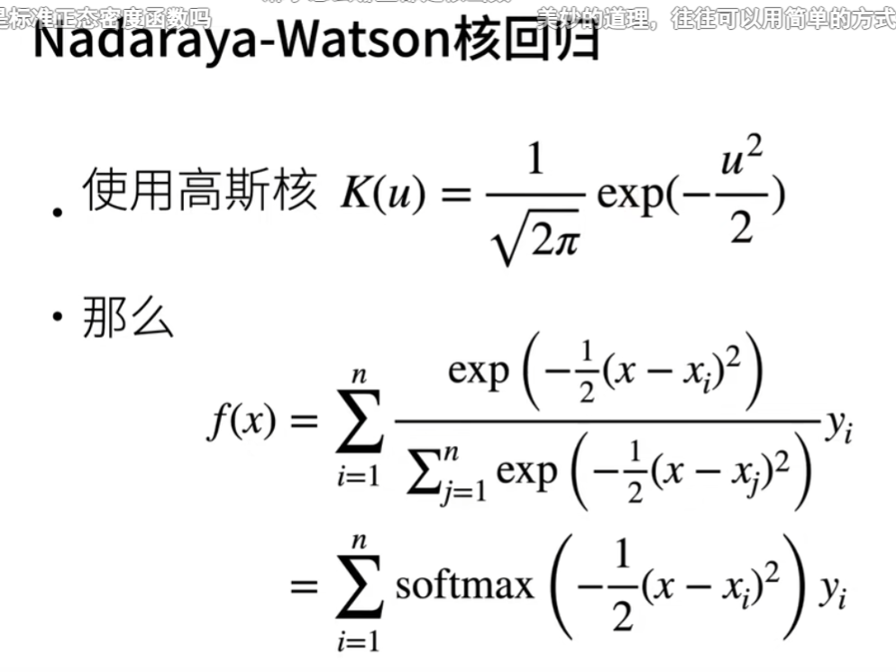
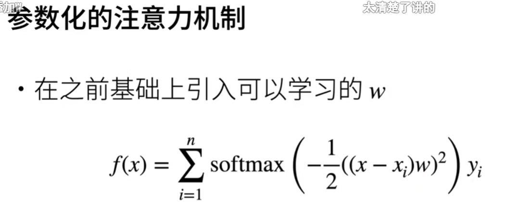
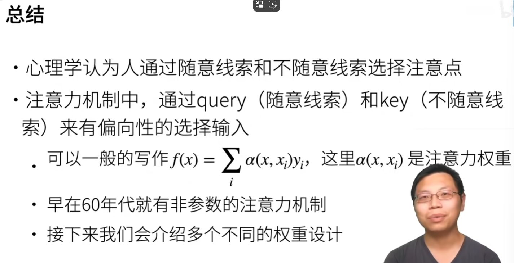

# 注意力机制
## 心理学
动物需要在复杂环境下有效关注值得注意的点   
心理学框架：人类根据随意线索和不随意线索选择注意点   
不随意线索就是无意识状态看到的东西   
刻意线索 不刻意线索   
## 注意力机制
卷积、全连接、池化层都只考虑不随意线索   
### 注意力机制则显示的考虑随意线索   
随意线索被称之为查询（query）   
每个输入是一个值（value）和不随意线索（key）的对   
通过注意力池化层来有偏向性的选择某些输入   
## 非参注意力池化层
给定数据（xi，yi）   
平均池化是最简单的方案   
更好的方案是60年代提出来的Nadaraya- Watson核回归   

## 参数化的注意力机制
在之前基础上引入可学习的w   

w是一个标量   
## 总结

# 代码
## 生成数据集
## 非参数注意力汇聚（池化）

