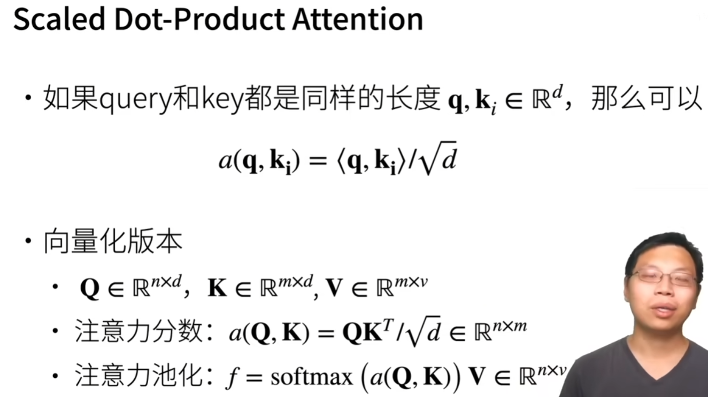

# 注意力分数

## 拓展到高维度

q、k、v 长度可以不一样   
注意力池化层   输出为长度为v   
## Additive Attention
加性注意力   
h是一个超参数   

等价于将query和key合并起来后放入到一个隐藏大小为h输出大小为1的单隐藏层MLP 这里图片写错了   
## Sacled Dot-Product Attention

query、key是同样的长度   
除以根号d  对长度没那么敏感   
## 总结
注意力分数是query和key的相似度，注意力权重是分数的softmax结果   
两种常见的分数计算：   
将query和key合并起来进入到一个单输出单隐藏层的MLP   
直接将query和key做内积   

# 代码
## 注意力打分函数
### 遮蔽softmax操作
### 加性注意力
### 缩放点积注意力

# QA

