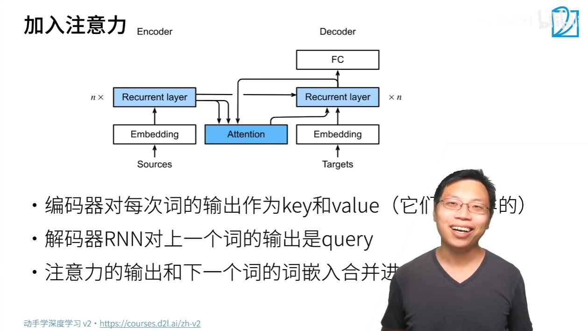

# 动机
机器翻译中，每个生成的词可能相关于源句子中不同的词   
seq2seq模型不能对此直接建模   
# 加入注意力

# 总结
seq2seq中通过隐状态在编码器和解码器中传递信息   
注意力机制可以根据解码器RNN的输出来匹配到合适的编码器RNN的输出来更有效地传递信息   

# 代码
## 带有注意力机制的解码器基本接口
## 实现带有Bahdanau注意力的循环神经网络解码器

# QA

