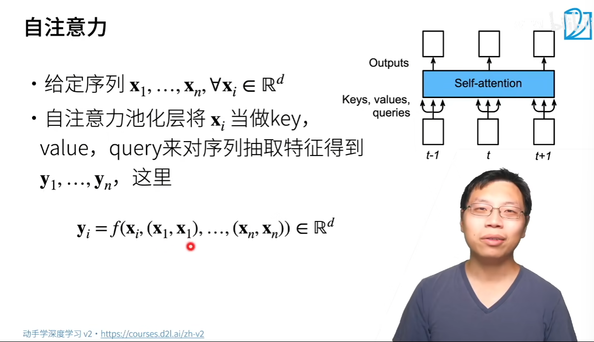
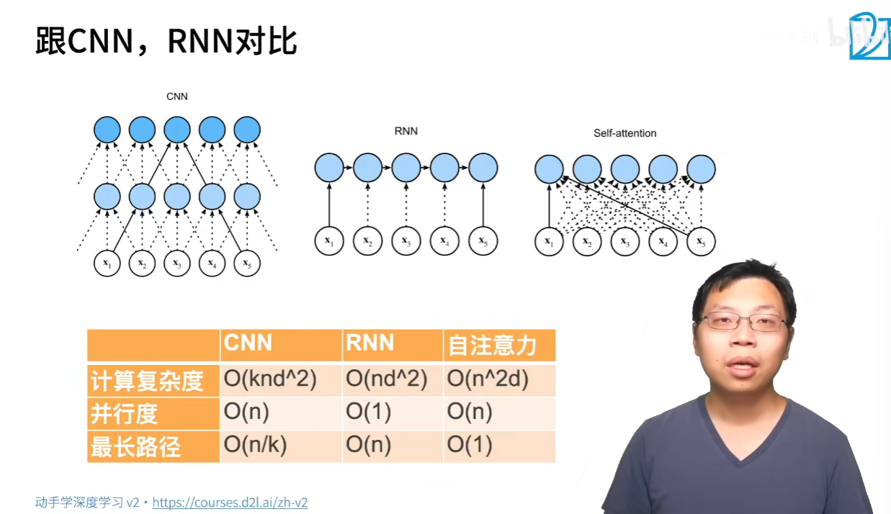
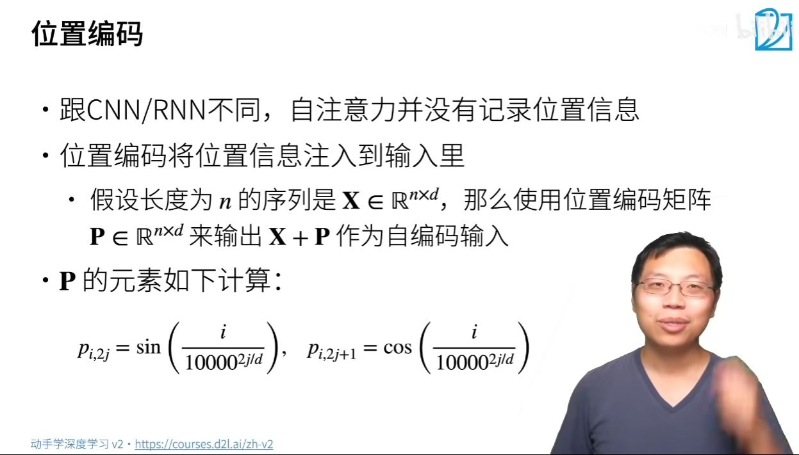
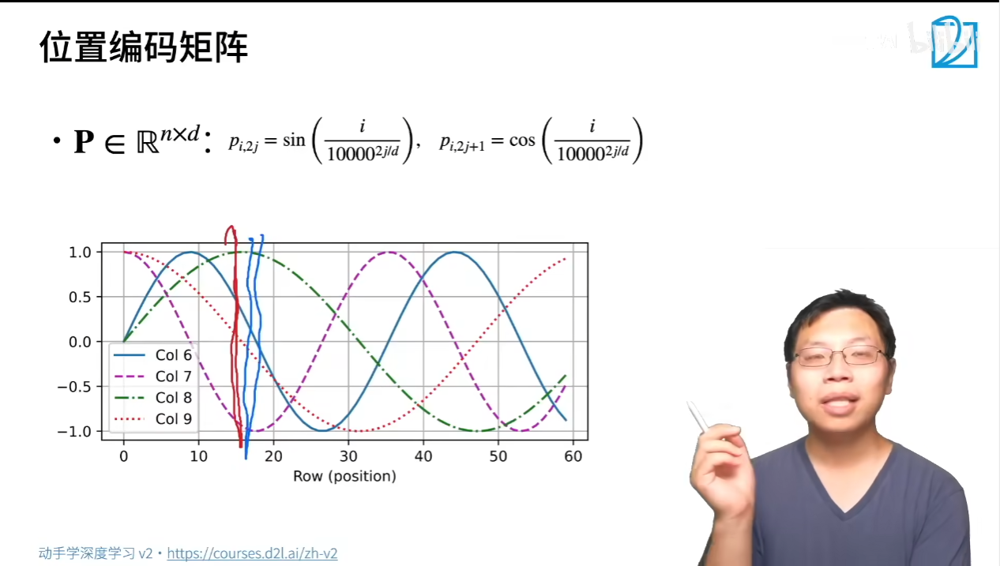
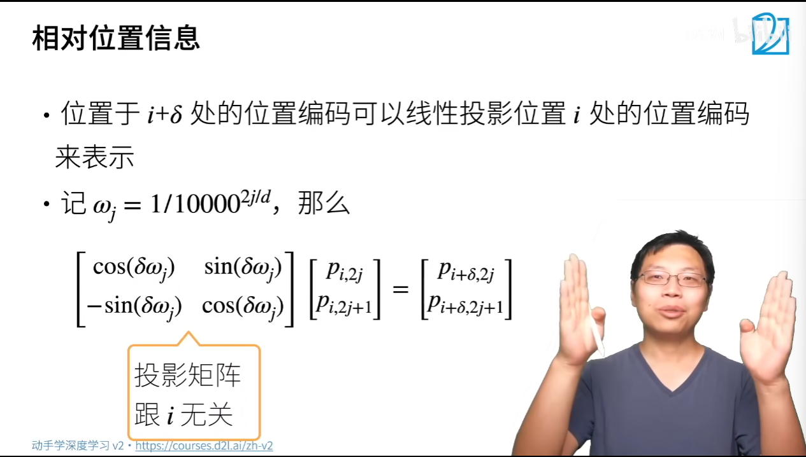
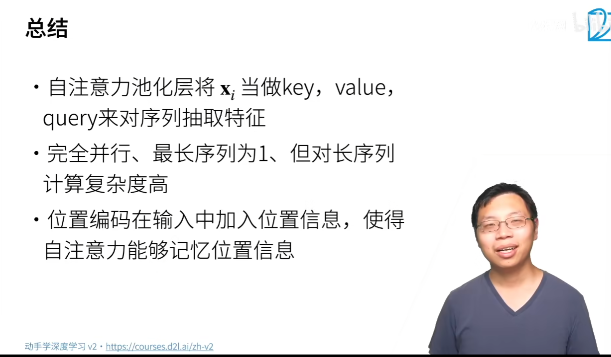

[本节教材链接](https://zh.d2l.ai/chapter_attention-mechanisms/self-attention-and-positional-encoding.html#fig-cnn-rnn-self-attention)
# 自注意力

# 跟CNN，RNN对比

# 位置编码

位置信息直接加进去，没有concat   
# 位置编码矩阵

# 绝对位置信息

# 相对位置信息

# 总结

# 代码

# 答疑
