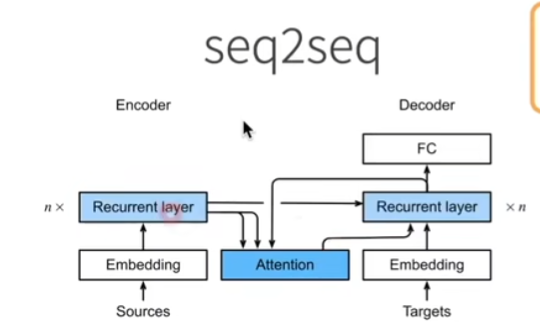
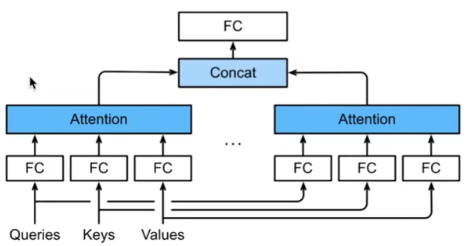
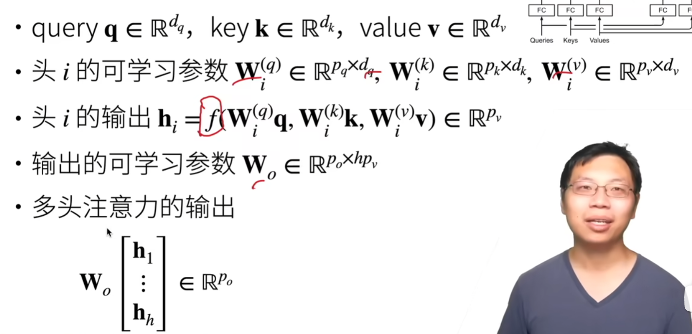
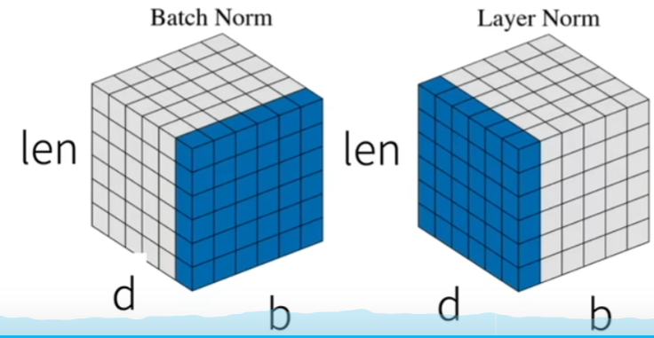

# Transformer架构
基于编码器-解码器架构来处理序列对   
跟使用注意力的seq2seq不同，transformer是纯基于注意力self-attention，没有RNN   

## 多头注意力
对同一个key，value，query，希望抽取不同的信息，例如短距离关系和长距离关系   
多头注意力使用h个独立的注意力池化

合并各个头（head）输出得到最终输出   
### 可学习的参数

n\*Wq、n\*Wk、n\*Wv、Wo   n表示头数   
## 有掩码的多头注意力
解码器对序列中一个元素输出时，不应该考虑该元素之后的元素   
可以通过掩码来实现，也就是计算Xi输出时，假装当前序列长度为i   
## 基于位置的前馈网络
将输入形状由（b，n，d）变换成（bn，d）   
batchsize、序列长度、维度   
作用两个全连接层   
输出形状由（bn，d）变化回（b，n，d）   
等价于两层核窗口为1的一维卷积层   
## 层归一化
批量归一化对每个特征/通道里元素进行归一化，不适合序列长度会变的NLP应用   
层归一化对每个样本里的元素进行归一化   

## 信息传递
编码器中的输出y1，……，yn   
将其作为解码中第i个Transformer块中多头注意力的key和value，它的query来自目标序列   
意味着编码器和解码器中块的个数和输出维度都是一样的   
## 预测
预测第t+1个输出时   
解码器中输入前t个预测值   
在自注意力中，前t个预测值作为key和value，第t个预测值还作为query   
## 总结
transformer是一个纯使用注意力的编码-解码器   
编码器和解码器都有n个transformer块   
每个块里使用多头（自）注意力，基于位置的前馈网络，和层归一化   

# 代码
## 多头注意力
### 选择缩放点积注意力作为每一个注意力头
### 使多个头并行计算
### 测试
## Transformer
### 基于位置的前馈网络
全连接+ReLU+全连接
### 改变张量的最里层维度的尺寸
### 对比不同维度的层归一化和批量归一化的效果
### 使用残差连接和层归一化
### 实现编码器中的一个层
Transformer编码器中的任何层都不会改变其输入的形状
### Transformer编码器
### Transformer解码器也是由多个相同的层组成
### Transformer解码器
### 训练
# QA
concat比加权平均效果好

