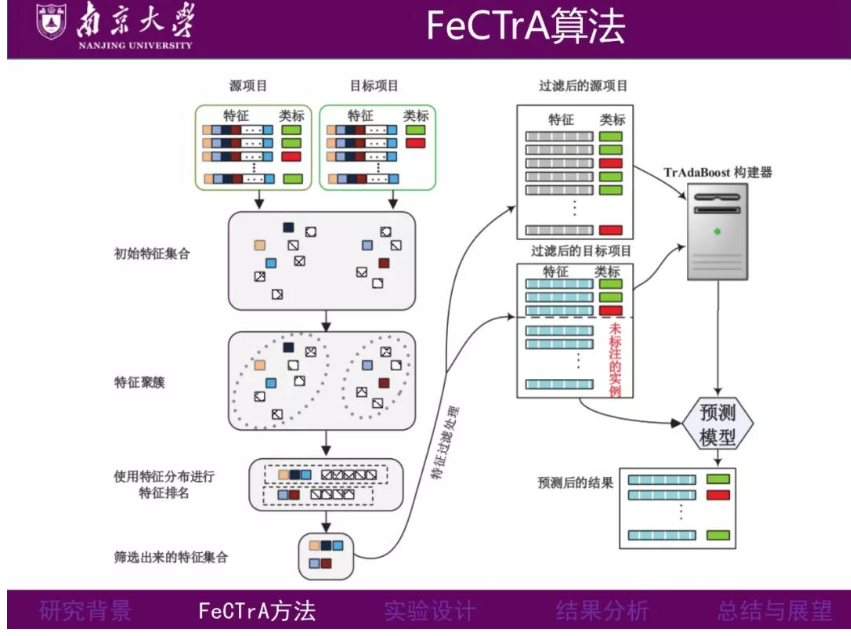
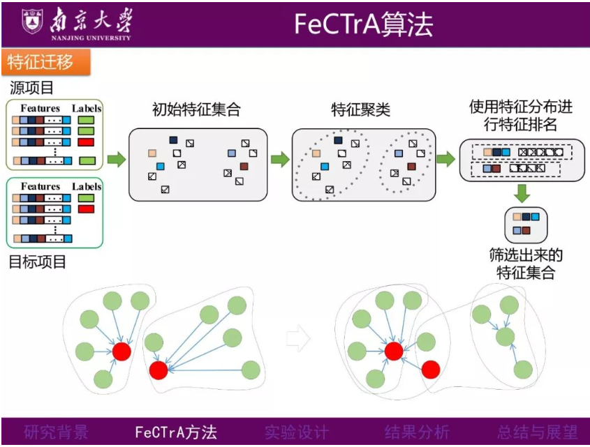

# 跨项目缺陷预测
## 背景与需求
软件规模扩大，缺陷预测技术important   
如何进行跨项目缺陷预测是一个重要问题   
由于不同项目之间的数据分布情况存在差异，传统的同项目缺陷预测方法无法满足需求   
目前已有的跨项目缺陷预测方法较少考虑到缺陷预测数据中的类别不平衡问题
已提出：基于样本权值的采样方法，将其与迁移学习方法结合，提出了跨项目软件缺陷预测方法TSboostDF   
[一种新的基于迁移学习的跨项目缺陷预测方法](https://mp.weixin.qq.com/s/aJx22jirewftX0RN2ppZ8g)    

需要进行软件安全漏洞预测的项目可能是来自新公司或属于新启动的项目, 没有足够的已标记安全缺陷报告供在实践中构建此软件安全漏洞预测模型.    
已提出：以安全关键字过滤为思路提出一种融合知识图谱的跨项目安全缺陷报告预测方法KG-SBRP (knowledge graph of security bug report prediction). 使用安全缺陷报告中的文本信息域结合CWE (common weakness enumeration)与CVE Details (common vulnerabilities and exposures)共同构建三元组规则实体, 以三元组规则实体构建安全漏洞知识图谱, 在图谱中结合实体及其关系识别安全缺陷报告.    
[基于知识图谱的跨项目安全缺陷报告预测方法](https://mp.weixin.qq.com/s/7kWf8UdDHVn6s7ioszpZnQ)   

软件开发中的很多缺陷模式具有通用性，跨项目缺陷预测能够通过识别和复用这些通用模式，帮助在新项目中进行缺陷预测。   
通过预测新项目中的潜在缺陷位置，团队可以提前分配测试资源，优化开发流程，提高软件质量。   

## 挑战
特征异质性：不同项目之间的代码特征、缺陷分布可能存在显著差异。例如，一个项目可能是用Java编写的，而另一个项目可能是用Python编写的，这些差异可能影响缺陷预测模型的准确性。   
数据分布不一致：
领域差异：
小样本问题：

## 方法
基于特征迁移和实例迁移

## 创新点
**深度学习与迁移学习融合：自适应迁移学习、深度特征提取
基于对抗学习的域适应：对抗性域适应
多视图学习与集成方法：多视图特征融合**

针对类别不平衡问题  提出什么方法？
1. 采样：欠采样、过采样
2. 代价敏感学习
3. 基分类器 集成学习
4. 

虽然在软件故障预测、类不平衡处理和跨项目预测方面取得了重大进展，但研究差距仍值得进一步探索。值得注意的是，一个感兴趣的领域在于研究类不平衡处理和跨项目预测技术之间的相互作用。了解类不平衡如何影响跨项目预测，反之亦然，可以为提高实际软件工程设置中预测模型的准确性和鲁棒性提供有价值的见解。   
   
文献综述对软件故障预测、类不平衡处理和跨项目预测进行了全面的概述。它揭示了类别不平衡的挑战以及跨项目预测在增强模型泛化和性能方面的潜在好处。基于这些知识，本文的后续部分将介绍方法、实验结果和讨论，以解决研究问题，并通过跨项目分析促进软件故障预测的发展。   

# 跨项目缺陷预测（CPDP）
迁移学习、领域适配
存在的问题：
数据分布差异
类不平衡问题
创新点：
